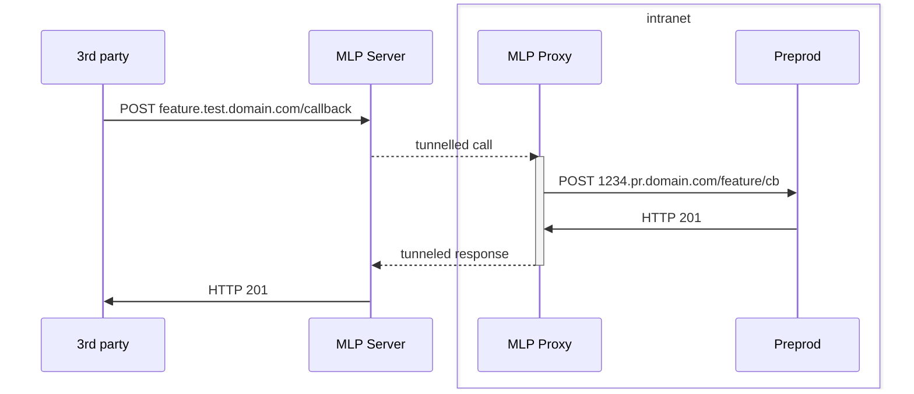

# MyLittleProxy [](http://godoc.org/github.com/cajax/mylittleproxy) [](https://goreportcard.com/report/github.com/cajax/mylittleproxy)

MyLittleProxy is a reverse proxy for cases where you cannot or do not want to expose entire development or testing environment to extranet, but also need to test an endpoint or single page.

For example, you need to test an Oauth flow or web callback from third-part service.

It is based on the modified [koding/tunnel](https://github.com/koding/tunnel) lib. 
## How it works
Server side receives incoming HTTP connections and tunnels them to clients based on assigned domain names. 

Replies from clients are forwarded to requesting side via the same tunnel. 

For example remote server sends HTTP POST to your `feature.test.domain.com/callback`, this request is routed to `1234.pr.domain.com/feature/cb` guarded by firewall via tunnel. Reply from preproduction server is routed to caller. 


## Building server and client
`make build`

This will generate two binaries and 2 default configs

## Running the server
#### First you need a machine exposed to extranet. 
It will receive HTTP commands from clients and incoming requests from web.

_As of now server doesn't implement HTTPS connections, so you may want to set it up behind nginx or other proxy._

You may want to add a wildcard DNS record to automatically catch incoming connections.

#### Configure the server
```json
{
  "debug": true,
  "listen": ":8080",
  "signatureKey": "secretkey",
  "allowedHosts": ["^.*\\.your-public-domain\\.com$"],
  "allowedClients": ["1234"],
  "controlPath" : "/customControlPath"
}
```
* `debug` enable more human-readable log format
* `listen` IP and port to listen to for incoming connections. This includes both control connections from clients and requests from web thus needs to be allowed by firewall
* `signatureKey` A secret key you share between server and clients. Client will use it to sign identifier while communicating with server
* `allowedHosts` List of regex rules to filter allowed domains names. If requested URL didn't match any it will fail with `error 400`
* `allowedClient` List of client IDs allowed to use this server. If this list is empty then any client with valid signature will be allowed to connect
* `controlPath` Use custom path for control protocol if default (`/_controlPath`) interferes with your needs. Leave empty or remove from config to use default value

#### Run server
`server -c path/to/config.json` or just `server` if the `config.json` is in the same directory

## Running the client
#### Configure client
```json
{
  "debug": true,
  "identifier": "1234",
  "serverAddress": "localhost:8080",
  "signatureKey": "secretkey",
  "proxy": {
    "http": {
      "domain": "1234.domain.com",
      "target": "https://local.host",
      "rewrite": [
        {
          "from": "/test",
          "to": "/api/test"
        }
      ]
    }
  }
}
```
* `debug` enable more human-readable log format
* `identifier` set custom identifier. Leave empty if you want to automatically use the host name. If you use multiple instances of the same container image or VM with the same host name you really should set custom identifier per instance.
* `serverAddress` address of proxy server
* `signatureKey` secret key shared between server and client to sign control calls from client
* `controlPath` Use custom path for control protocol if default (`/_controlPath`) interferes with your needs. Leave empty or remove from config to use default value. This must match the same of server config
* `proxy.http.domain` is the desired domain at the server side that will be routed to this client
* `proxy.http.target` is the target host protocol and port. Requests will be routed to this host
* `proxy.http.rewrite` list of Regex expressions to rewrite paths in URLs. This list must contain at least one entry and may be as simple as a pair `/ -> /` but then you risk to expose entire local web server. Only requests with matched path will be routed to client. You may use RegEx capture groups and replacements (e.g. `$1`).

#### Run
`client -c path/to/config.json` or just `client` if the `config.json` is in the same directory


# License

The BSD 3-Clause License - see LICENSE for more details
