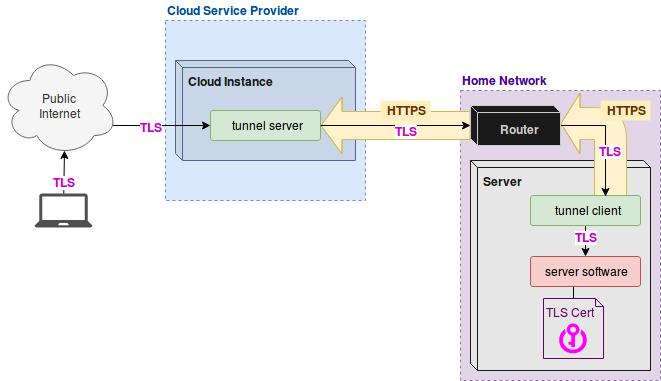

## threshold

Public Internet facing gateway (TCP reverse tunnel) for server.garden.


This project was originally forked from https://github.com/koding/tunnel

It is intended to be used to make it easier for non-tech-savvy people to host web services that are avaliable on the public internet.

This repository only includes the application that does the tunneling part.  It does not include any other management or automation tools.

See the usage example folder for a basic test.



### How it is intended to be used:

1. An automated tool creates a cloud instance and installs and configures the tunnel server on it. 
1. An automated tool installs the tunnel client on the self-hoster's server computer. 
1. An automated tool calls the `PUT /tunnels` api on the tunnel server's Management Port, and sends a JSON file describing which ports should be opened on the tunnel server, which client they should be tunneled to, and which service on the client they should be tunneled to, as well as whether or not the HAProxy "PROXY" protocol should be used. This connection can use TLS Client Authentication.
1. The tunnel client connects to the tunnel server on the Tunnel Control Port. This connection can use TLS Client Authentication. This connection will be held open and re-created if dropped.
1. An internet user connects to the tunnel server on one of the ports defined in the JSON. The internet user's request is tunneled through the original connection from the tunnel client, and then proxied to the web server software running on the self-hoster's server computer.


### Output from Usage example showing how it works:

```
Starting the tunnel server with tunnel mux port: 9056, management port: 9057 

Starting the "listener" test app. It listens on port 9001.  This would be your web  application server.

2020/08/06 14:00:03 threshold server is starting up using config:
{
  "DebugLog": false,
  "TunnelControlPort": 9056,
  "ManagementPort": 9057,
  "CaCertificateFile": "InternalCA+chain.crt",
  "ServerTlsKeyFile": "localhost.key",
  "ServerTlsCertificateFile": "localhost+chain.crt"
}
Listener: I am listening on port 9001
2020/08/06 14:00:03 runServer(): the server should be running now
Starting the tunnel client.  Client Identifier: TestClient1

2020/08/06 14:00:04 theshold client is starting up using config:
{
  "DebugLog": false,
  "ClientIdentifier": "TestClient1",
  "ServerHost": "localhost",
  "ServerTunnelControlPort": 9056,
  "ServerManagementPort": 9057,
  "ServiceToLocalAddrMap": {
    "fooService": "127.0.0.1:9001"
  },
  "CaCertificateFile": "InternalCA+chain.crt",
  "ClientTlsKeyFile": "TestClient1@example.com.key",
  "ClientTlsCertificateFile": "TestClient1@example.com+chain.crt"
}
runClient(): the client should be running now
Checking the list of connected clients.
HTTP GET localhost:9057/clients:
{"TestClient1":{"CurrentState":"ClientConnected","LastState":"ClientUnknown"}}

Sending the tunnel configuration to the server.
HTTP PUT localhost:9057/tunnels:
now listening on 127.0.0.1:9000

[{"HaProxyProxyProtocol":true,"ListenAddress":"127.0.0.1","ListenHostnameGlob":"*","ListenPort":9000,"BackEndService":"fooService","ClientIdentifier":"TestClient1"}]

Starting the "sender" test app. 
It connects to the front end port of the tunnel (port 9000).  This would be your end user who wants to use the web application.

Sender: I am dialing localhost:9000 from 127.0.0.1:59382
Sender: sent 16 bytes
Listener: Someone connected from: 127.0.0.1:59382
Listener: read 16 bytes
Listener: the sender sent: Hello ! Hello! 

Listener: I am going to respond with "asd"
Listener: conn.Close()
Sender: read 3 bytes
Sender: Response from listener was: asd
Done. Now terminating forked processes and cleaning up.. 
```

Note how the listener sees the original source IP and port, not the source IP and port of the connection from the tunnel client, because the listener supports the PROXY protocol and reports the source ip and port it recieves that way.

### Why did you set it up this way?

I have a few requirements for this system. 

* It should be 100% automatable. It is intended to be used in a situation where it is unreasonable to ask the user to configure thier router, for example, they don't know how, they don't want to, or they are not allowed to (For example they live in a dorm where the University manages the network).
* Users have control over their own data.  We do not entrust cloud providers or 3rd parties with our data, TLS keys/certificates, etc. In terms of every day usage, this is a TLS connection from an internet user directly to the self-hoster's computer. It is opaque to the cloud provider. 
  * If the cloud provider wants to launch a Man in the Middle attack, even if they could secretly obtain a trusted cert to use, it will not be easy to hide from the user as long as the user (or software that they installed) is anticipating it. 
* It should support Failover/High Avaliability of services.  Therefore, it needs to be able to have multiple tunnel clients connected at once, which can be hot-swapped via a Management API.

### What did you add on top of the koding/tunnel package?

* A command line application which can be run in client mode or server mode based on a JSON config file. 
  * Optional TLS with Client Authentication
  * management API:
    * GET /clients
    * PUT /tunnnels
* Simplicity and Laser-like focus on "opaque" usage of TCP. Removed HTTP/WebSocket/old Virtual Hosts code.
* Added support for HAProxy "PROXY" protocol. 
* Added support for port mappings between front end and back end. 
* Introduced concept of a "service" string instead of port number, so the client decides what ports to connect to, not the server. 
* Added support TLS SNI based virtual hosts. (Hostname based routing)
* Fixed various bugs related to connection lifecycle.

### How to build

```
go build -o tunnel -tags netgo 

# -tags netgo? what?
# this is a work around for dynamic linking on alpine linux
# see: https://stackoverflow.com/questions/36279253/go-compiled-binary-wont-run-in-an-alpine-docker-container-on-ubuntu-host

docker build -t sequentialread/tunnel:0.0.1 .
```